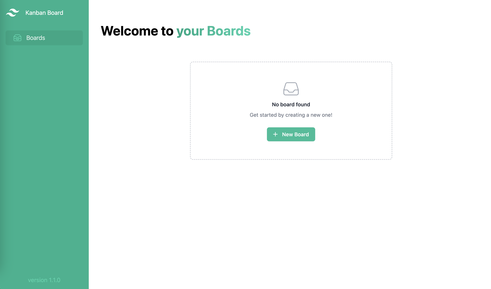
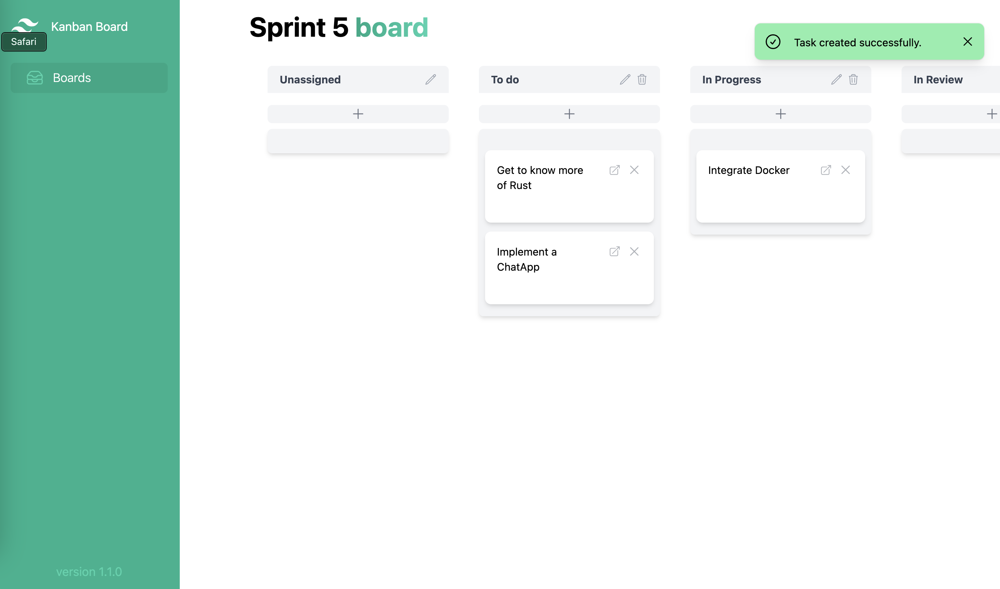
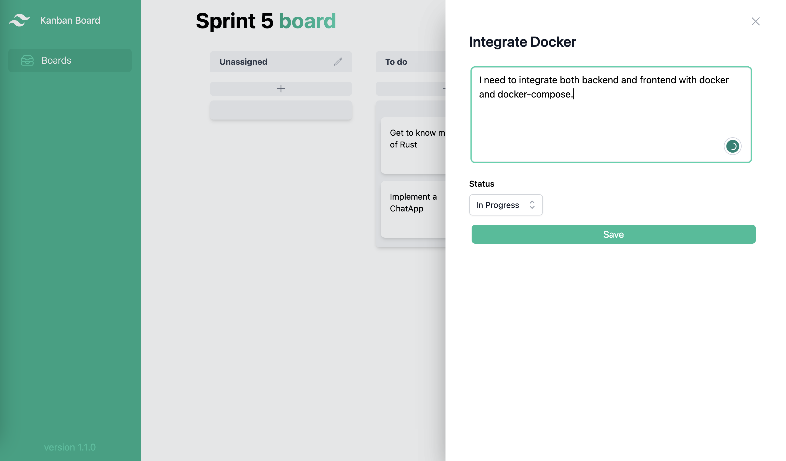

# Calories project

Web app used to keep track of calories/meals

## How to run

### Run with Docker Compose

```bash
docker compose up -d
```

Application should now be visible at [http://localhost:3000/](http://localhost:3000/)

## Alternative launch
### Run the backend

You need to first set up a `.env` file in the `server` folder and specify the 
`MONGO_URI` and `APP_NAME` environment variable.
Then you may run:

```bash
cd server
cargo run
```

### Run the frontend
```bash
cd client
npm run dev
```

You may now open the app at [http://localhost:3000](http://localhost:3000)


## App preview




